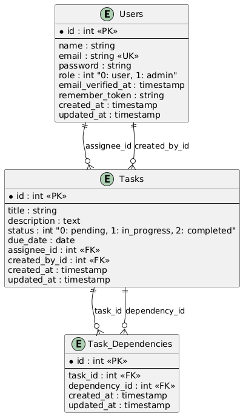

# Task Management System

A comprehensive task management system built with Laravel 11, featuring role-based access control, task dependencies, and a robust API architecture.

## 📋 Features

-   **🔐 Role-Based Authentication**: Separate access levels for managers and users
-   **📝 Task Management**: Create, update, and track tasks with multiple status levels
-   **🔗 Task Dependencies**: Link tasks with dependency relationships
-   **⏰ Due Date Tracking**: Set and monitor task due dates
-   **👥 User Assignment**: Assign tasks to specific users
-   **📊 Status Management**: Track task progress (pending, in-progress, completed)
-   **🔍 Advanced Filtering**: Filter tasks by status, assignee, and date ranges
-   **📱 RESTful API**: Clean API architecture with resource transformations
-   **🛡️ Security**: Laravel Sanctum for API authentication

## � Live Demo

**Base URL**: `https://grizi7.space/api/v1`

### Test Credentials

The system comes with pre-seeded test accounts:

**Manager Accounts:**

-   Email: `manager1@softxpert.com` | Password: `password`
-   Email: `manager2@softxpert.com` | Password: `password`

**User Accounts:**

-   Email: `user1@softxpert.com` | Password: `password`
-   Email: `user2@softxpert.com` | Password: `password`
-   Email: `user3@softxpert.com` | Password: `password`

## �🏗️ Architecture & Structure

The project follows a clean architecture pattern with a well-organized structure:

### Core Architecture Components

-   **Repository Pattern**: Data access abstraction layer
-   **Service Layer**: Business logic separation and processing
-   **Resource Transformers**: Consistent API response formatting
-   **Request Validation**: Comprehensive input validation with custom base classes
-   **Enum Types**: Type-safe status and role management
-   **Middleware**: Role-based access control and authentication

### Directory Structure Overview

```
app/
├── Core/                    # Base framework components
│   ├── Controllers/         # Base API controller with common functionality
│   ├── Repositories/        # Abstract repository pattern implementation
│   ├── Services/           # Base service layer with CRUD operations
│   ├── Requests/           # Base request validation with JSON error handling
│   └── Traits/             # Reusable traits (API responses, etc.)
├── Contracts/              # Interface definitions for repositories and services
├── Enums/                  # Type-safe enumerations (TaskStatus, UserRole)
├── Http/
│   ├── Controllers/Api/V1/ # Versioned API controllers
│   ├── Middleware/         # Custom middleware (RoleMiddleware)
│   ├── Requests/          # Form request validation classes
│   └── Resources/         # API resource transformers
├── Models/                # Eloquent models with relationships
├── Repositories/          # Data access layer implementations
└── Services/             # Business logic layer implementations
```

### Validation System

The project implements a robust validation system:

#### Base Request Class

-   **Automatic JSON Error Handling**: Returns structured JSON errors for API requests
-   **Consistent Response Format**: Standardized error responses across all endpoints
-   **Authorization Integration**: Built-in authorization checks

#### Request Validation Examples

**Task Creation/Update:**

```php
'title' => 'required|string|max:255',
'description' => 'nullable|string',
'due_date' => 'nullable|date',
'assignee_id' => 'required|exists:users,id'
```

**Authentication:**

```php
'email' => 'required|email',
'password' => 'required|string|min:6'
```

**Status Updates:**

```php
'status' => 'required|integer|in:0,1,2'  // pending, in-progress, completed
```

#### Validation Features

-   **Dynamic Validation**: Rules change based on HTTP method (POST vs PUT)
-   **Database Validation**: Validates foreign key relationships
-   **Custom Error Messages**: Structured JSON error responses
-   **Type Safety**: Integration with PHP enums for status/role validation

## 🚀 Tech Stack

-   **Backend**: Laravel 11.x (PHP 8.2+)
-   **Database**: MySQL
-   **Authentication**: Laravel Sanctum

## 📦 Installation

### Prerequisites

-   PHP 8.2 or higher
-   Composer

### Setup Steps

1. **Clone the repository**

    ```bash
    git clone https://github.com/Grizi7/Task-Management-System.git
    cd Task-Management-System
    ```

2. **Install PHP dependencies**

    ```bash
    composer install
    ```

3. **Environment setup**

    ```bash
    cp .env.example .env
    php artisan key:generate
    ```

4. **Database setup**

    ```bash
    touch database/database.sqlite
    php artisan migrate
    php artisan db:seed
    ```

5. **Start development servers**

    ```bash
    php artisan serve       # API server
    ```

## 🔧 Configuration

### Environment Variables

Key environment variables in `.env`:

```env
APP_NAME="Task Management System"
DB_CONNECTION=mysql
DB_DATABASE=task_management
DB_USERNAME=root
DB_PASSWORD=password
```

## 📚 API Documentation

**Base URL**: `https://grizi7.space/api/v1`

All API endpoints should be prefixed with the base URL above.

### Authentication

#### Login

```http
POST https://grizi7.space/api/v1/login
Content-Type: application/json

{
    "email": "manager1@softxpert.com",
    "password": "password"
}
```

**Response:**

```json
{
    "status": true,
    "message": "Login successful",
    "data": {
        "user": {
            "id": 1,
            "name": "Manager One",
            "email": "manager1@softxpert.com",
            "role": 1
        },
        "token": "your-api-token-here"
    }
}
```

#### Logout

```http
DELETE https://grizi7.space/api/v1/logout
Authorization: Bearer {token}
```

### Tasks

#### Get All Tasks

```http
GET https://grizi7.space/api/v1/tasks?status=0&per_page=15&assignee_id=1
Authorization: Bearer {token}
```

#### Get Single Task

```http
GET https://grizi7.space/api/v1/tasks/{id}
Authorization: Bearer {token}
```

#### Create Task (Manager only)

```http
POST https://grizi7.space/api/v1/tasks
Authorization: Bearer {token}
Content-Type: application/json

{
    "title": "New Task",
    "description": "Task description",
    "due_date": "2025-12-31",
    "assignee_id": 3
}
```

#### Update Task Status

```http
PATCH https://grizi7.space/api/v1/tasks/{id}/status
Authorization: Bearer {token}
Content-Type: application/json

{
    "status": 1
}
```

#### Add Task Dependencies (Manager only)

```http
POST https://grizi7.space/api/v1/tasks/{id}/dependencies
Authorization: Bearer {token}
Content-Type: application/json

{
    "dependency_ids": [2, 3, 4]
}
```

### Remove Task Dependency (Manager only)

```http
PUT /api/tasks/{id}/dependencies/{dependency_id}
Authorization: Bearer {token}
Content-Type: application/json

{
    "dependency_ids": [2]
}

```

### Status Codes for Tasks

-   `0` - Pending
-   `1` - In Progress
-   `2` - Completed

### User Roles

-   `0` - User (can view assigned tasks, update status)
-   `1` - Manager (full access to all tasks and management features)

## 🏛️ Database Schema

### Entity Relationship Diagram (ERD)



_The ERD above shows the relationships between Users, Tasks, and Task Dependencies tables._

### Table Descriptions

#### Users Table

-   `id` - Primary key
-   `name` - User full name
-   `email` - Email address (unique)
-   `role` - User role (0: user, 1: manager)
-   `password` - Hashed password

#### Tasks Table

-   `id` - Primary key
-   `title` - Task title
-   `description` - Task description
-   `status` - Task status (0: pending, 1: in-progress, 2: completed)
-   `due_date` - Due date (optional)
-   `assignee_id` - Foreign key to users
-   `created_by_id` - Foreign key to users (creator)

#### Task Dependencies Table

-   `task_id` - Foreign key to tasks
-   `dependency_id` - Foreign key to tasks (dependency)

### Relationships

-   **Users → Tasks (assignee)**: One-to-Many (A user can be assigned multiple tasks)
-   **Users → Tasks (creator)**: One-to-Many (A user can create multiple tasks)
-   **Tasks → Task Dependencies**: Many-to-Many (Tasks can have multiple dependencies and be dependencies for other tasks)

## 📁 Project Structure

```
app/
├── Core/                 # Base classes and utilities
│   ├── Controllers/      # Base API controller
│   ├── Repositories/     # Repository pattern base
│   ├── Services/         # Service layer base
│   └── Traits/          # Reusable traits
├── Enums/               # Enum definitions
├── Http/
│   ├── Controllers/     # API controllers
│   ├── Requests/        # Form request validation
│   └── Resources/       # API resource transformers
├── Models/              # Eloquent models
├── Repositories/        # Data access layer
└── Services/           # Business logic layer
```

## 🤝 Contributing

1. Fork the repository
2. Create a feature branch (`git checkout -b feature/amazing-feature`)
3. Commit your changes (`git commit -m 'Add amazing feature'`)
4. Push to the branch (`git push origin feature/amazing-feature`)
5. Open a Pull Request

## 📝 License

This project is open-sourced software licensed under the [MIT license](LICENSE).

## Contributing

Thank you for considering contributing to the Laravel framework! The contribution guide can be found in the [Laravel documentation](https://laravel.com/docs/contributions).

## Code of Conduct

In order to ensure that the Laravel community is welcoming to all, please review and abide by the [Code of Conduct](https://laravel.com/docs/contributions#code-of-conduct).

## Security Vulnerabilities

If you discover a security vulnerability within Laravel, please send an e-mail to Taylor Otwell via [taylor@laravel.com](mailto:taylor@laravel.com). All security vulnerabilities will be promptly addressed.

## License

The Laravel framework is open-sourced software licensed under the [MIT license](https://opensource.org/licenses/MIT).

## 👩‍💻 Author

**Grizi7**
[Portfolio](https://grizi7.com)
